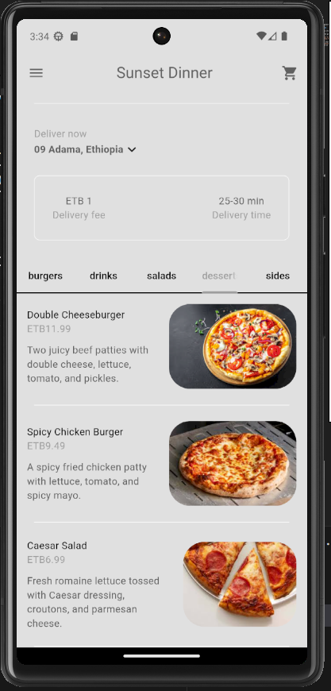

## Project Description

The Food Delivery System is an intuitive platform designed to simplify and enhance the process of ordering food from various restaurants. This system provides a seamless experience for users to browse, order, and receive food at their convenience. It also offers robust tools for restaurant management and delivery tracking. The system includes the following key features:

### User Registration
Users can create an account within the platform by providing their relevant information such as name, email address, and delivery address. The registration process includes password creation and validation to ensure secure access.

### User Login
Once registered, users can log in using their credentials (email address and password). The system authenticates the user's credentials before granting access to personalized features and information.

### User Profile
After logging in, users can access and edit their profile information. They can update their contact details, delivery address, and other relevant information to ensure accurate and efficient order processing.

### Restaurant Browsing
Users can browse through a list of partnered restaurants. Each restaurant profile includes a detailed menu, prices, and user reviews, allowing customers to make informed choices.

### Menu and Food Selection
Users can view detailed menus from each restaurant, including descriptions, prices, and images of the dishes. They can select their desired items and customize their orders based on available options.

### Order Placement
Once users have selected their desired food items, they can place an order through a streamlined checkout process. This includes selecting delivery options, payment methods, and reviewing the final order before confirmation.

### Real-Time Order Tracking
After placing an order, users can track the status of their delivery in real-time. This feature provides updates on order preparation, dispatch, and estimated delivery time.

### Payment Integration
The system supports multiple payment methods, including credit/debit cards, digital wallets, and cash on delivery. This flexibility ensures a convenient and secure payment process for users.

### Delivery Management
Delivery personnel can use the system to manage and track their deliveries. They receive real-time updates on new orders, delivery addresses, and optimized routes to ensure timely and efficient deliveries.

### Order History
Users can view their past orders, including order details, delivery times, and payment receipts. This feature allows users to easily reorder their favorite meals and track their spending.

### Restaurant Management
Restaurant partners have access to a dedicated dashboard to manage their menus, track orders, and analyze sales data. This feature helps restaurants streamline their operations and improve service quality.

### Customer Support
The platform includes a customer support feature that allows users to contact support for any issues or inquiries related to their orders. This ensures prompt resolution of problems and enhances the overall user experience.

### Summary
The Food Delivery System is a comprehensive and user-friendly platform designed to facilitate the ordering and delivery of food from a variety of restaurants. With its extensive features, the system enhances convenience for users, improves efficiency for delivery personnel, and provides valuable tools for restaurant management.

    

        

        
    

    

